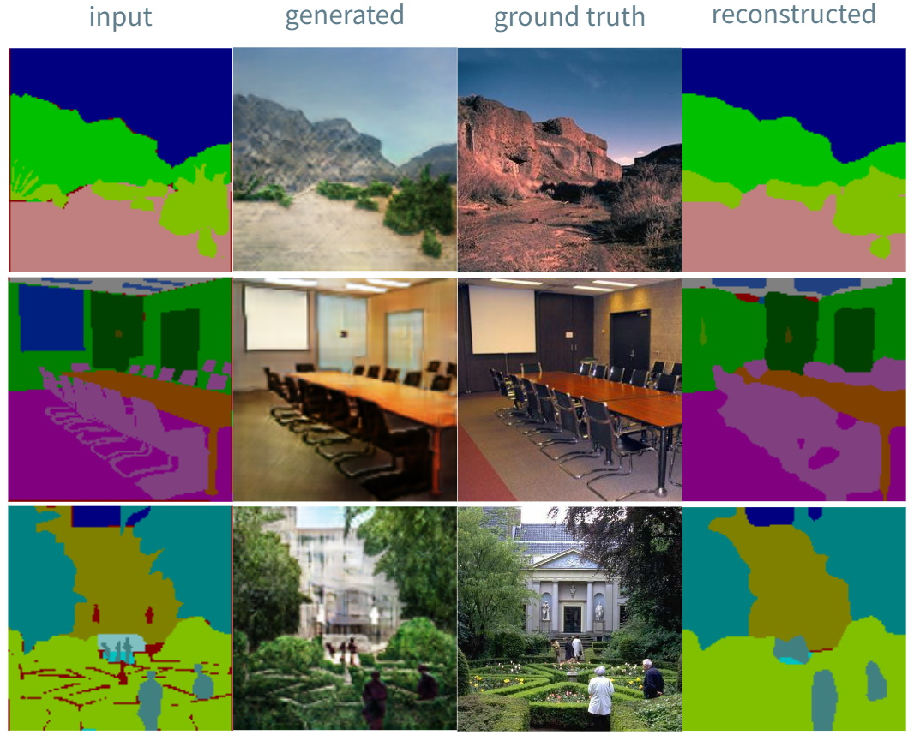
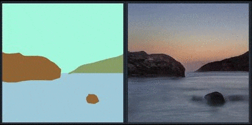
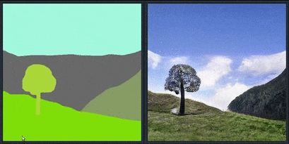
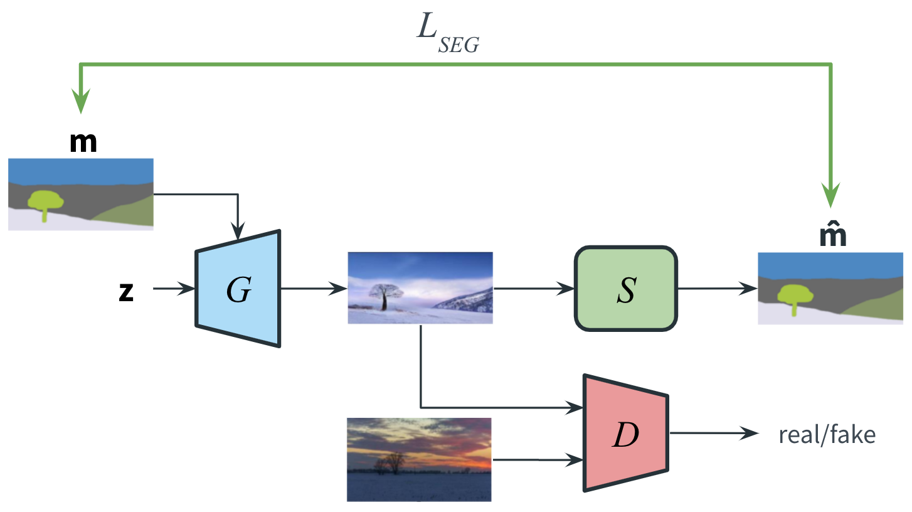

# Unpaired Semantic Segmentation and Image Synthesis with SPADE and UPerNet

<div align="center">
  
</div>

<br/>
<div align="center">
  
  &nbsp;&nbsp;&nbsp;&nbsp;&nbsp;&nbsp;&nbsp;&nbsp;
  
</div>

### Model architecture
An adaptation of [SPADE](https://github.com/NVlabs/SPADE.git) to unpaired data samples. It exploits a semantic segmentation network (from [CSAILVision's semantic segmentation](https://github.com/CSAILVision/semantic-segmentation-pytorch)) to introduce a reconstruction loss over the semantic labels. Check the [presentation](./slides.pdf) for more details.


<div align="center">
  
</div>


## Get started

Clone this repo.
```bash
git clone https://github.com/materight/unpaired-SPADE.git
cd unpaired-SPADE/
```

This code requires PyTorch 1.0 and python 3+. Please install dependencies by
```bash
pip install -r requirements.txt
```


## Dataset preparation

For COCO-Stuff, Cityscapes or ADE20K, the datasets can be downloaded and prepared following [SPADE](https://github.com/NVlabs/SPADE#dataset-preparation). 

The ADE20K dataset used to test the model can be downloaded [here](http://data.csail.mit.edu/places/ADEchallenge/ADEChallengeData2016.zip) (from [MIT Scene Parsing BenchMark](http://sceneparsing.csail.mit.edu/)). After the download, unzip it inside the the `datasets/` directory. 


## Testing pre-trained models

Once the dataset is ready, the result images can be generated using a pre-trained model:

1. Download the zip of the pre-trained models from [here](https://drive.google.com/uc?id=1ocEiHW1CDFK22LIwxCogX32RYomGWztH) and unzip them inside the `checkpoints/` directory.

2. Generate images using a pre-trained model.
    ```bash
    python test.py --name [experiment] --dataset_mode [dataset] --dataroot [path_to_dataset] --evaluate --load_from_opt_file
    ```
    `[experiment]` is the directory name of the checkpoint file downloaded in Step 1. `[dataset]` can be one of `coco`, `ade20k`, and `cityscapes`, and `[path_to_dataset]` is the path to the dataset. If you are running on CPU mode, append `--gpu_ids -1`.

3. The outputs images are stored at `./results/[type]_pretrained/` by default. You can view them using the autogenerated HTML file in the directory. Use `--results_dir` to specify an alternative output directory. 

Use `--evaluate` to also compute FID score, mIoU and accuracy over the generated images. If you want to testo only over a subset of the dataset, use `--how_many` to specify the maximum number of images to generate. 

There are many other options that can be specified, please use `python test.py --help` to see them all.  


## Training new models

New models can be trained with the following command.

```bash
python train.py --name [experiment_name] --dataset_mode [dataset_mode] --dataroot [path_to_ade20k_dataset]
```

You can use `python train.py --help` to see all the available options.


## Available options

Besides the options from the original [SPADE](https://github.com/NVlabs/SPADE.git) repository, new options have been added:
- `--evaluate`: use with `test.py` to compute also FID, mIoU and accuracy scores over the generated images.
- `--use_seg`: enable unpaired training with a cycle-consistency loss and a semantic segmentation model.
- `--netS`: select the model to use for the semantic segmentation model.
- `--pretrained_seg`: use pretrained weights for the semantic segmentation model.
- `--use_input_seg`: use also the paired semantic label to further train the semantic segmentation network.
- `--lambda_seg`: lambda parameter to re-weight the semantic segmentation loss.
- `--beta_seg`: beta value for the class-balanced loss for semantic segmentation.
- `--gamma_seg`: gamma parameter for the semantic segmentation focal loss.


## Code structure

- `train.py`, `test.py`: the entry point for training and testing.
- `trainers/pix2pix_trainer.py`: harnesses and reports the progress of training.
- `models/pix2pix_model.py`: creates the networks, and compute the losses
- `models/networks/`: defines the architecture of all models
- `options/`: creates option lists using `argparse` package. More individuals are dynamically added in other files as well. Please see the section below.
- `data/`: defines the class for loading images and label maps.


## Acknowledgments
This code borrows heavily from [SPADE](https://github.com/NVlabs/SPADE.git) and [CSAILVision's Semantic Segmentation](https://github.com/CSAILVision/semantic-segmentation-pytorch).
